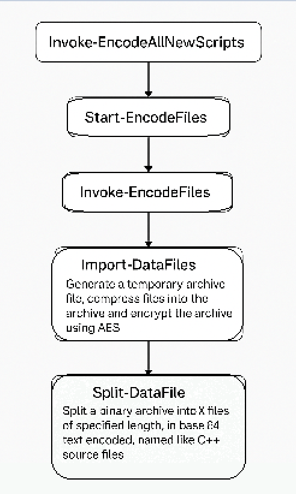
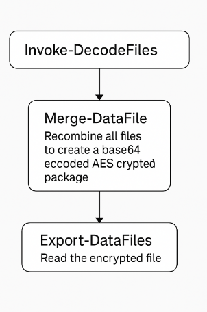

# WinClient Auto-Update Script

## Overview
The **WinClient Auto-Update Script** automates checking for new versions of a software package (in this case scripts), downloading updates if available using a encoding process. 
The whole flow is meant to secure and disguise file content for controlled extraction or inclusion in a software project. It ensures the latest version of certain scripts are installed, while keeping those scripts obfuscated in the repo.

## Features
- **Version Checking**: Compares the locally installed version with the latest version available online.
- **Automated Download**: Retrieves the latest version from a public repository when an update is detected.
- **Secure Storage**: Uses encrypted credentials stored in the Windows Registry.
- **Decompression & Processing**: Extracts and processes the update package automatically.

## How It Works - Encoding

The purpose of Invoke-EncodeAllNewScripts is to automate the secure packaging and encoding of scripts or data files. 
It begins by compressing and AES-encrypting the original data into a temporary archive (Import-DataFiles). 
This encrypted archive is then split into multiple chunks (Split-DataFile) of a fixed length, base64-encoded for safe embedding in source files<sup>[1](https://github.com/arsscriptum/winclient-psprofile#notes)</sup>., and saved with names mimicking C++ source files<sup>[1](https://github.com/arsscriptum/winclient-psprofile#notes)</sup>. to obfuscate and prepare them for use in another application or deployment process. 
The whole flow is meant to secure and disguise file content for controlled extraction or inclusion in a software project.



## How It Works - Decoding

The goal of Invoke-DecodeFiles is to reverse the encoding process and restore the original files from their obfuscated and encrypted state. 
It begins by calling Merge-DataFile, which scans for the previously split and base64-encoded file fragments (in this case as source code files<sup>[1](https://github.com/arsscriptum/winclient-psprofile#notes)</sup>), and recombines them into a single encrypted binary package. 
Once reconstructed, this package is passed to Export-DataFiles, which decrypts the AES-encrypted archive and extracts its contents, recovering the original scripts or data files. 
This function effectively serves as a secure and controlled unpacking mechanism, ensuring only authorized or intentional decoding restores the sensitive or embedded payload.




## Dependencies
- PowerShell 5.1 or later
- Windows OS with Registry access
- Internet connection to fetch updates

## Installation
1. Clone the repository or download the script files.
2. Ensure execution permissions are granted:
   ```powershell
   Set-ExecutionPolicy RemoteSigned -Scope CurrentUser
   ```
3. Run the script:
   ```powershell
   Invoke-EncodeAllNewScripts
   or
   Start-DecodeFiles
   ```

## Dependencies

#### Scripts

1. **Registry.ps1** - Registry getters / setters wrappers
2. **AppCredential.ps1** - Encrypt registry credewntials using the Windows Data Protection API (DPAPI), which means:
  - The encrypted string is tied to the user account.
  - Only the same user on the same machine can decrypt it.
  - The encryption key is automatically managed by Windows.


<h2 id="notes">Notes</h2>

The only reason I'm encoding the encrypted files as C++ text is **not obfuscation** but just because if I have a archive bigger than 50Mb, then the fact that Im splitting it and have 50 files of 1Mb cpp (instead of one binary 50Mb) makes Github think it's a code project and won't complain about big binary files. (see LFS)